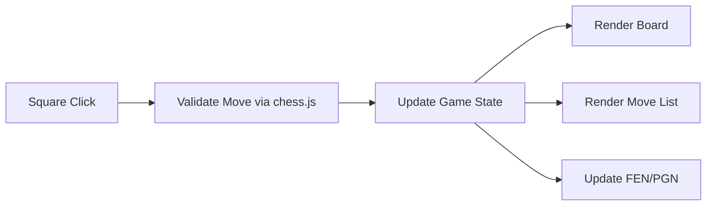

# Abhi Chess Studio

Browser-based chess workspace with legal move handling, notation export, and board orientation controls.

## Features

- Click-to-move piece interaction with legal target hints.
- Move history (SAN notation).
- Board flip for white/black perspectives.
- Export and copy:
  - FEN
  - PGN
- Load custom positions from FEN.
- Status panel for turn, check, checkmate, and draw states.

## Technical Design

- `index.html`: board + analysis controls and notation panes.
- `styles.css`: responsive board and side-panel styling.
- `script.js`: chess state management and UI rendering.
- Powered by `chess.js` for move generation and rules.



## Local Run

```bash
python -m http.server 8000
```

Open `http://localhost:8000`.

## GitHub Pages Compatibility

- Static frontend only.
- External dependency loaded from trusted CDN.
- Publish repository root on GitHub Pages.

## Future Improvements

- Add engine evaluation integration.
- Add draggable piece support.
- Add opening explorer and move-time stats.