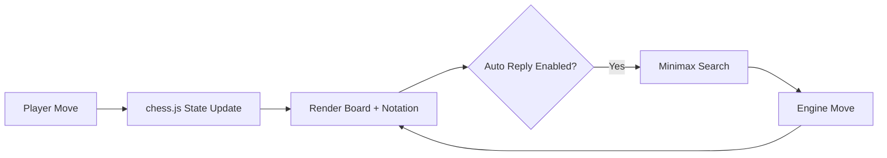

# Abhi Chess Engine

Browser-based chess workspace with legal move handling, notation tooling, and an in-browser minimax engine.

## Features

- Click-to-move board with legal-target highlighting.
- Move history in SAN notation.
- FEN / PGN export and copy.
- Copy Position Brief exports the current board read, evaluation summary, and engine line as one walkthrough artifact.
- Shareable URL state for custom positions, board orientation, engine-side setup, depth, auto-reply mode, and guided presets.
- Keyboard shortcut `S` now copies a shareable URL for the current position/orientation state.
- Load custom positions from FEN.
- Guided preset briefs explain what each built-in demo position is testing and which boards to read first.
- Board orientation flip.
- Engine module:
  - Select engine side (white/black)
  - Depth-controlled search (1-3 ply)
  - Manual `Engine Move` trigger
  - Auto-reply mode after player moves
- Evaluation uses piece values + piece-square tables.
- Evaluation panel separates material and positional terms for easier engine inspection.
- Tactical pressure panel surfaces mobility, capture density, checking moves, and rough game phase.
- Immediate captures board lists the direct tactical shots available to the side to move and highlights the highest-value target.
- King safety board estimates pawn shield quality and nearby enemy pressure around both kings.
- Endgame posture board reads whether the position is actually transitioning into a king-activity or pawn-race ending.
- Activity board summarizes which side and piece family currently own the most immediate mobility.
- Center control board tracks who is attacking or occupying the four core center squares before you drift into wing plans.
- Space pressure board estimates which side is actually owning forward squares and advanced footholds before a squeeze becomes real.
- Opening guide identifies common lines from the current SAN move order.
- Development board tracks minor-piece rollout, king safety posture, and central-pawn activation before the position leaves the opening.
- Engine line preview extends the top continuation into a short best-line sequence for portfolio walkthroughs.
- Move verdict now reports centipawn gap, candidate rank, and the best alternative from the prior position so mistakes read more concretely than a generic label.

## Technical Design

- `index.html`: board surface, notation tools, and engine controls.
- `styles.css`: responsive ink-themed layout and improved board contrast.
- `script.js`:
  - chess.js integration for legal move generation.
  - Alpha-beta minimax search for engine responses.
  - UI rendering and game-state synchronization.

## Practical walkthrough

- Play moves directly on the board or load a FEN to jump into a position.
- Use `S` to copy a shareable position link for portfolio walkthroughs.
- Use `Copy Position Brief` when you want one artifact that includes the board read, evaluation, engine line, and current engine setup.
- Flip the board or switch engine side to demo the same position from either perspective.



## Quick Verification

Run this syntax check before publishing browser changes:

```bash
node --check script.js
```

## Local Run

```bash
python -m http.server 8000
```

Open `http://localhost:8000`.

## Portfolio Demo Path

1. Play a short opening or load a custom FEN.
2. Read the tactical pressure, king safety, and opening guide boards together.
3. Trigger the engine and inspect the candidate moves plus line preview.
4. Copy the position brief for a portable walkthrough artifact.

## Position Handoff Workflow

- Share links are the fastest way to reopen one board state with orientation preserved.
- `Copy Position Brief` is the better path when a position needs both the board and the current evaluation story attached.
- FEN is the portable state export; PGN is the better export when the move order itself matters.

## GitHub Pages Compatibility

- Fully static frontend.
- CDN dependency: `chess.js` only.
- No server runtime required.

## Engine Limits

- The built-in engine is intentionally lightweight and walkthrough-friendly, not a serious competitive engine.
- Depth stays shallow so the position boards and move explanations remain responsive in the browser.
- Strongest use: inspect one tactical or structural claim, then compare it against the engine line preview.

## Future Improvements

- Add iterative deepening and move ordering heuristics.
- Add opening database lookup and ECO tagging.

## Interview-Style Demo Scenarios

Use this quick sequence for a higher-signal walkthrough:

1. Opening discipline:
- Load FEN `r1bqkbnr/pppp1ppp/2n5/4p3/2B1P3/5N2/PPPP1PPP/RNBQK2R b KQkq - 2 3` and compare opening guide with development board.
2. Tactical pressure:
- Create at least one forcing capture and compare immediate captures with engine line preview.
3. Endgame conversion:
- Load a king-and-pawn endgame FEN and inspect endgame posture plus king safety before exporting a position brief.

## Portfolio Positioning

- Project type: Browser chess analysis app (HTML, CSS, JavaScript)
- Verification path: Open index.html and validate move generation, engine move, and FEN load.

## Demo Flow

1. Load a preset or custom FEN.
2. Force a tactical sequence and compare the capture board against the engine line.
3. Export the position brief once the evaluation story is worth handing off.

## Quick Position Set

Use these three scenarios for a tighter walkthrough instead of free play:

1. Opening structure: show the opening guide plus development board.
2. Tactical shot: stage one forcing capture and compare it with the engine line preview.
3. Simplified ending: load an endgame FEN and read king safety against endgame posture.

