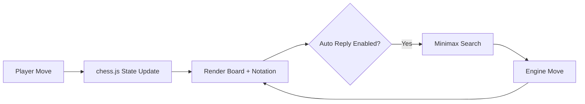

# Abhi Chess Engine

Browser-based chess workspace with legal move handling, notation tooling, and an in-browser minimax engine.

## Features

- Click-to-move board with legal-target highlighting.
- Move history in SAN notation.
- FEN / PGN export and copy.
- Copy Position Brief exports the current board read, evaluation summary, and engine line as one walkthrough artifact.
- Shareable URL state for custom positions and board orientation.
- Load custom positions from FEN.
- Board orientation flip.
- Engine module:
  - Select engine side (white/black)
  - Depth-controlled search (1-3 ply)
  - Manual `Engine Move` trigger
  - Auto-reply mode after player moves
- Evaluation uses piece values + piece-square tables.
- Evaluation panel separates material and positional terms for easier engine inspection.
- Tactical pressure panel surfaces mobility, capture density, checking moves, and rough game phase.
- Immediate captures board lists the direct tactical shots available to the side to move and highlights the highest-value target.
- King safety board estimates pawn shield quality and nearby enemy pressure around both kings.
- Endgame posture board reads whether the position is actually transitioning into a king-activity or pawn-race ending.
- Activity board summarizes which side and piece family currently own the most immediate mobility.
- Opening guide identifies common lines from the current SAN move order.
- Engine line preview extends the top continuation into a short best-line sequence for portfolio walkthroughs.

## Technical Design

- `index.html`: board surface, notation tools, and engine controls.
- `styles.css`: responsive ink-themed layout and improved board contrast.
- `script.js`:
  - chess.js integration for legal move generation.
  - Alpha-beta minimax search for engine responses.
  - UI rendering and game-state synchronization.



## Local Run

```bash
python -m http.server 8000
```

Open `http://localhost:8000`.

## GitHub Pages Compatibility

- Fully static frontend.
- CDN dependency: `chess.js` only.
- No server runtime required.

## Future Improvements

- Add iterative deepening and move ordering heuristics.
- Add opening database lookup and ECO tagging.
